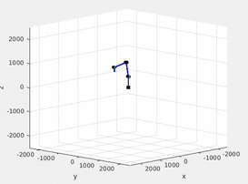
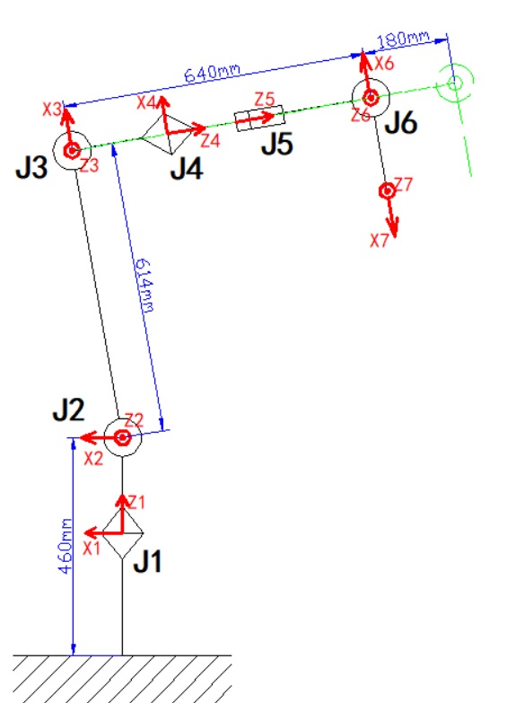
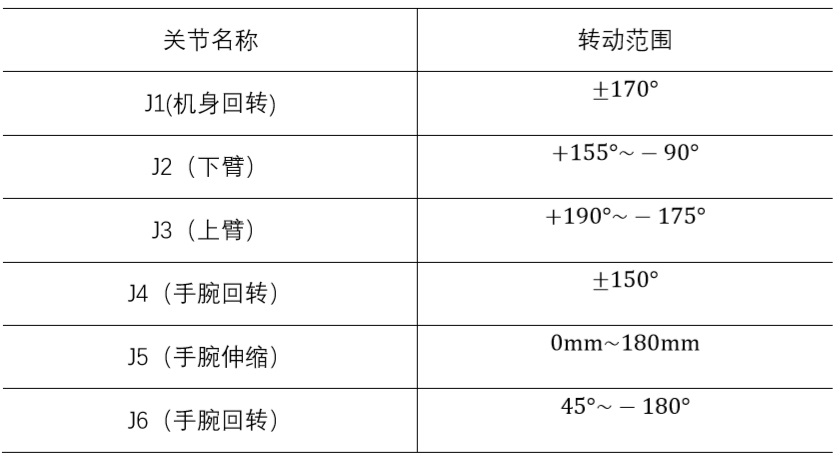
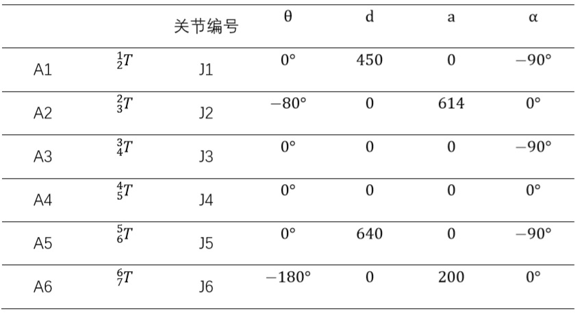

<p align="center">
    
</p>


## Contents
1. [Parameter](#Parameter)
2. [QuickStart](#QuickStart)


## Parameter
### Joint DOF
<p align="center">
    
</p>

### Angle limit
<p align="center">
    
</p>


### D-H parameter method
<p align="center">
    
</p>


## QuickStart

```bash
Open matlab
set path under /6DOF_1slide_Robot/code/  
run MovMyRobotDH.m file.
```

<p align="center">
    
</p>
